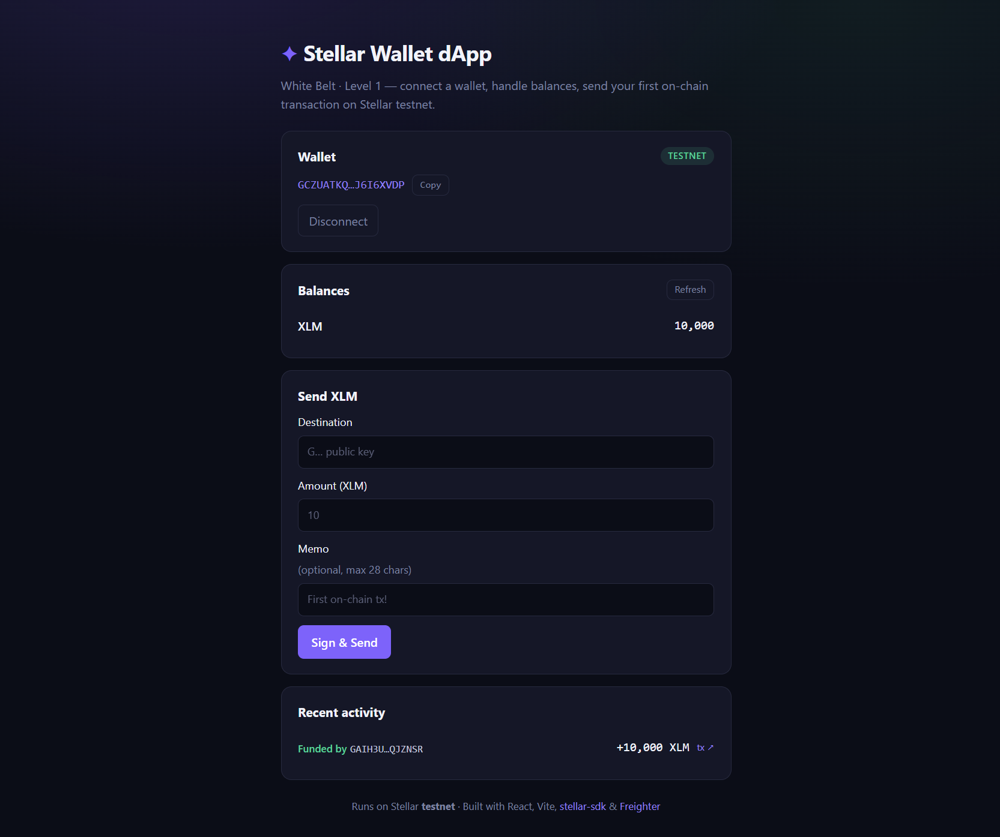
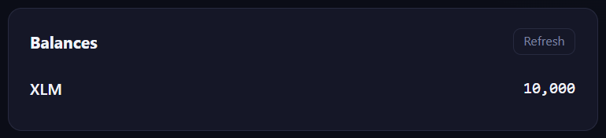
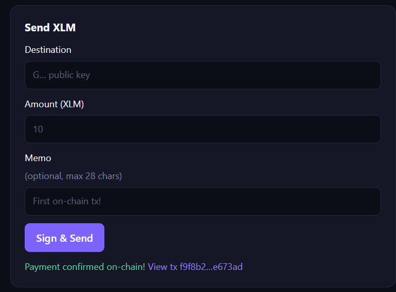

# ✦ Stellar Wallet dApp — White Belt (Level 1)

Submission for **Stellar Journey to Mastery: Monthly Builder Challenges** (Rise In) — Level 1 / White Belt.

> Build wallets, handle balances, and submit your first on-chain transactions on Stellar.

**🌐 Live demo:** [livingdeathz.github.io/stellar-wallet-dapp](https://livingdeathz.github.io/stellar-wallet-dapp/)

A React dApp running against the **Stellar testnet** that lets you:

- 🔗 **Connect a wallet** — via the [Freighter](https://www.freighter.app/) browser extension, with network detection (warns if you're not on Testnet)
- 💰 **Handle balances** — loads all balances for the connected account from Horizon, with one-click **Friendbot funding** for brand-new accounts (10,000 test XLM)
- 🚀 **Send on-chain transactions** — build an XLM payment (destination + amount + optional memo), sign it with Freighter, submit it to Horizon, and get a [stellar.expert](https://stellar.expert/explorer/testnet) explorer link for the confirmed transaction
- 📜 **Recent activity** — shows the account's latest payments (sent / received / funded) straight from the chain

## Tech stack

| Layer | Tool |
|---|---|
| Frontend | React 19 + TypeScript + Vite |
| Stellar SDK | [`@stellar/stellar-sdk`](https://www.npmjs.com/package/@stellar/stellar-sdk) (Horizon, TransactionBuilder) |
| Wallet | [`@stellar/freighter-api`](https://www.npmjs.com/package/@stellar/freighter-api) |
| Network | Stellar **Testnet** (Horizon: `https://horizon-testnet.stellar.org`) |

## Getting started

**Prerequisites:** Node.js 18+, and the [Freighter extension](https://www.freighter.app/) installed in your browser (switched to **Testnet** in its settings).

```bash
npm install
npm run dev
```

Open the printed URL (default `http://localhost:5173`) and:

1. Click **Connect Freighter** and approve access in the extension.
2. If the account is new, click **Fund with Friendbot** to receive 10,000 test XLM.
3. Fill in a destination `G…` address, an amount, and an optional memo, then **Sign & Send**.
4. Approve the transaction in Freighter — the confirmed tx hash links straight to the explorer.

## Screenshots

| Wallet connected | Balance displayed | Successful testnet transaction |
|---|---|---|
|  |  |  |

## Project structure

```
src/
├── lib/stellar.ts              # Horizon client, balances, Friendbot, payment build/sign/submit
├── components/
│   ├── ConnectCard.tsx         # Wallet connect / network badge / address
│   ├── BalanceCard.tsx         # Balance list + Friendbot funding
│   ├── SendPaymentCard.tsx     # Payment form with validation + result link
│   └── HistoryCard.tsx         # Recent on-chain payments
└── App.tsx                     # Wiring + state
```

## Build

```bash
npm run build   # type-check + production bundle in dist/
```
